#### 2017-05-02:

- npm库：
>marked

- 工具：
>browserSync

***
#### 2017-05-03:

- npm命令：
```
npm ls --depth 0
```

***
#### 2017-05-24:

- string <=> object
```
字符串解析成json：
var str = '{"name":"huangxiaojian","age":"23"}'
var json=JSON.parse(str);
console.log(json,typeof json);
注意：单引号写在{}外，每个属性都必须用双引号

对象解析成字符串：
var a = {a:1,b:2};
var stringfy=JSON.stringify(a);
console.log(stringfy,typeof stringfy);
```

***
#### 2017-05-23:

- body overflow:hidden 在移动端失效了?
```
html,body {
    height: 100%;
    overflow: hidden;
}
body {
    position: relative;
}
```

***
#### 2017-05-22:

- nginx配置本地测试环境：

1。 nginx.conf是自己的配置文件，使用的时候可以替换conf文件夹中的nginx.conf文件。

2。 打开html文件，需要在该文件中建立本地映射。
    方法：在本文件中打开命令行工具，输入mklink /j "C:\Program Files" "D:\Program Files"
    前面的地址是映射地址，后面的地址是原项目文件目录。
    例如：mklink /j "D:\20170503\tool\nginx\nginx-1.9.7\html\cgigc" "D:\workspace\web\cgigc"   
    
3。 双击nginx.exe打开本地服务器

4。 浏览器输入要打开文件地址（localhost/+文件目录/）。
例如：`http://localhost/cgigc/special-9/index.html`

*软件下载地址：链接: https://pan.baidu.com/s/1o8qekDs 密码: yh5z*

***
#### 2017-06-27:

##### React项目笔记：

- 项目引入jquery：
```
import $ from 'jquery';
```
-  `$("")`获取元素
```
$("")能获取组件中的元素，获取不了index.html中的元素
console.log($('.plug'),$('.plug').html(),$('.rev_slider').html());
```
- jquery获取绑定事件元素用`$(event.target)`
```
itemSelected(event){
    event.stopPropagation();
    if (!$(event.target).parents('.navItem').hasClass("itemNow")) {
        ···
    }
}
```
- React中引入JQ插件：
> `render() {}`函数中填写插件html部分

> `componentDidMount() {}`函数中填写插件依赖的js

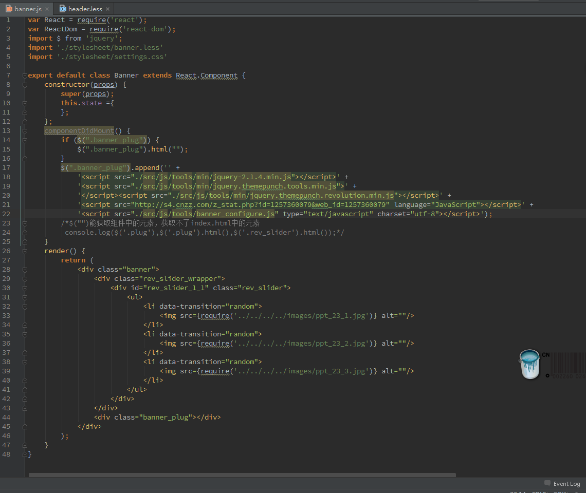

- 图片引入
> 直接引用，路径为html相对于图片的相对路径
```

```
> 使用`require`引用，路径为此时js相对于图片的相对路径
```

```

***
#### 2017-06-28:

##### React项目笔记：

- 函数传参：
> 1。
```
<Link to={item.to} data-index={index} onMouseEnter={this.itemSelected} onMouseLeave={this.itemUnselected}>
    {item.name} {item.children&&item.children.length!=0?<span></span>:null}
</Link>

itemSelected(event){
    event.stopPropagation();
    if (!$(event.target).parents('.navItem').hasClass("itemNow")) {
        $(event.target).parents('.navItem').addClass('active');
    }
}
itemUnselected(event){
    event.stopPropagation();
    if (!$(event.target).parents('.navItem').hasClass("itemNow")) {
        $(event.target).parents('.navItem').removeClass('active');
    }
}
```
> 2。
```
<button onClick={(ev, arg1, arg2,……) => {this.handleClick(ev, arg1, arg2,……)}}/>

handleClick(ev, arg1, arg,……) {
    //code
}
```
> 3。
```
<li key={index} onMouseEnter={this.itemEnter.bind(this,index)}>
    。。。
</li>
itemEnter(index) {
    this.props.indexChange(index);
}
```
***
#### 2017-07-17:

- lastIndexOf()：
```
var str='hello world!';
console.log(str.length); //12
console.log(str.lastIndexOf('')); //12
```
***
#### 2017-07-18:

- React输出一个类：
```
import $ from 'jquery';
var base_url = "http://www.51pos.com/api/api/saasweb/";
function indexUrl() {
	return base_url + "Warehouse/123/10203006/admin";
}
var service={
	ajax:function(callback){
		$(function(){
			$.ajax({
				url:indexUrl(),
				success:function(data){
					callback&&callback(data);
				}
			})
		});
	}
}
export default service;
```
- jQuery :lt 选择器：
```
选择前 2 个 <tr> 元素：
$("tr:lt(2)")
```
***
#### 2017-07-20:

- 获取数组中最小值：
```
Math.min.apply(null,Array)
Math.min(x,y)
```
- 数组排序：
```
var arr=[3,2,12,56,4,3,5];
arr.sort(function (a,b) {
	return a-b;
});
```
***
#### 2017-08-04:

- scrollTop()方法滚动页面：
```
$('.go_footer').click(function(){
	$('html,body').animate({scrollTop:$('.footer').offset().top}, 800);
});


$("html").scrollTop(100);//火狐IE下可以（火狐IE不用在服务器下测试）
$("body").scrollTop(100);//谷歌内核的浏览器360和谷歌（服务器下测试）

$("html，body").scrollTop(100);//这样写才兼容

```
***
#### 2017-08-10:

- `MongoVUE`,`MongoDB`软件下载：
*软件下载地址：链接: https://pan.baidu.com/s/1mhTSbDA 密码: 9mtw，
链接: https://pan.baidu.com/s/1qY4XBsw 密码: q3cu*

- `MongoVUE`连接`MongoDB`不显示数据问题：

    Mongodb3.0支持用户自定义存储引擎，用户可配置使用mmapv1或者wiredTiger存储引擎。
    3.2版本以后默认的开启的是wiredTiger存储引擎，之前用的是mmapv1存储引擎。
    并且2个存储引擎生成的数据文件格式不兼容。也就是说mmapv1引擎生成的数据文件
    wiredTiger引擎读取不出来。

> 1。要想知道MongoDB到底开启了哪个引擎，最简单的方式查看数据文件。
出现如下格式的数据文件是wiredTiger存储引擎启动了：

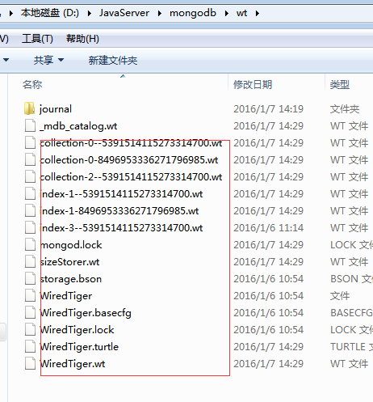

出现如下数据格式启动的是：mmapv1存储引擎

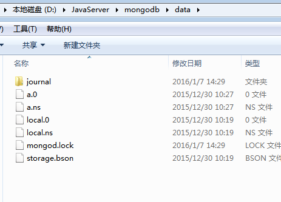

> 2。通过命令启动wiredTiger 存储引擎：

`mongod --storageEngine wiredTiger  --dbpath 数据目录`

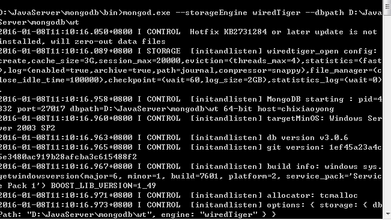

mongo 客户端连接效果：

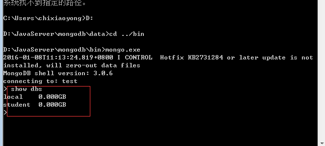

mongoVE连接效果：

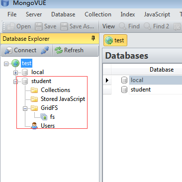

> 3。启动mmapv1 存储引擎

`mongod  --storageEngine mmapv1 --dbpath 数据目录`

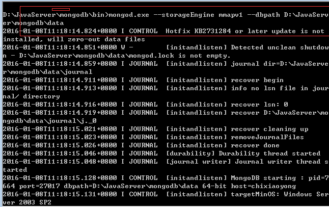

mongo连接如下：

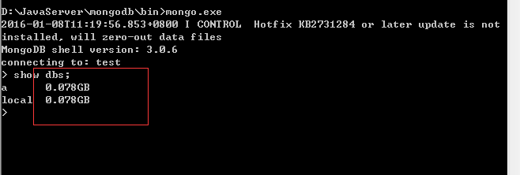

mongoVE连接如下图所示：

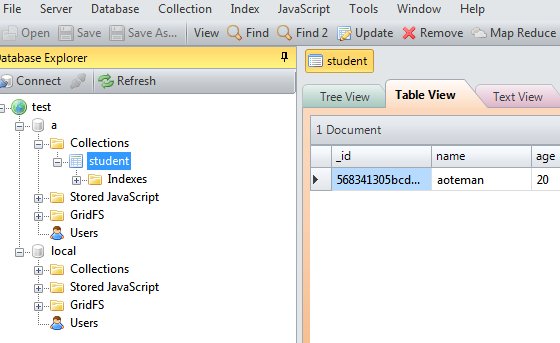
***
#### 2017-08-10:

- 本地打开数据库(在MongoDB安装文件bin里面运行CMD)：
```
C:\Program Files\MongoDB\Server\3.4\bin>mongod --storageEngine mmapv1 --dbpath D:\20170503\helloWorl
d\GitHub.com\coding\mongo
```
***
#### 2017-08-19:

- 模块规范：

1 。CMD规范

   ```
   define(function (require, module, exports) {
       function convert(input) {
           return parseFloat(input);
       }

       function add(a, b) {
           return convert(a) + convert(b);
       }

       module.exports = {add,subtract};
   })
   ```
2 。在NODE中实现的是Commonjs规范

    ```
    function convert(input) {
        return parseFloat(input);
    }

    function add(a, b) {
        return convert(a) + convert(b);
    }

    module.exports = {add,subtract};
    ```
- 模块输出的区别：

1。属性
```
module.exports=new Date();
调用：
var date = require('./module/date.js');

```
2。行为方法（函数）
```
module.exports=()=>{
return new Date();
}
调用：
var date = require('./module/date.js')();

```

属性输出会有缓存，不会重新调用。函数输出调用时会重新执行，不会有缓存。
***
#### 2017-08-30:

- 创建.gitignore文件方法：
1。右键选择Git Bash 进入命令行，进入项目所在目录。 输入`touch .gitignore`命令。
2。创建txt文件，将文本名字和扩展名改为`.gitignore.`,确定。
***
#### 2017-09-01:

- 删除无法直接删除的文件的方法：
右键点击"添加到压缩文件"，选择压缩选项中的"压缩后删除源文件"，确定。
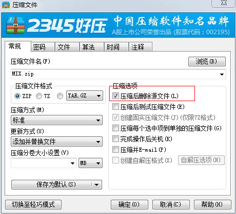
***
#### 2017-09-02:

- dependencies和devDependencies：
>dependencies：生产环境依赖，拿给别人用的时候有没有依赖
devDependencies:开发环境依赖，开发这个库的时候需要

node_modules的包的package.json的dependencies为空的时候，说明这个包没有平行依赖，可以直接拷贝使用。

***
#### 2017-09-17:

- Notepad++显示目录树方法：
>设置-->首选项-->勾选‘文件列表面板’中的‘显示’前面选框

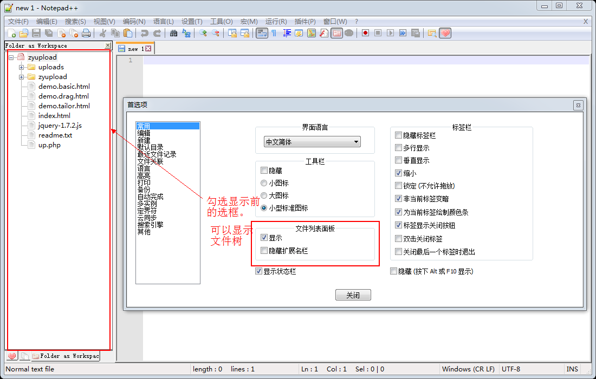

***
#### 2017-09-27:

- 知识点：
>JQuery contains的选择器

contains选择符是指对象中包括指定内容的对象本身，如:$('td:contains("coding")').addClass('active');则是找到所有包含“coding”这样内容的单元格，设置这些单元格的样式类型添加“active”类。

>HTML <td> 标签的 rowspan 属性

rowspan 属性规定单元格可横跨的行数。
***
#### 2018-01-24:

- Linux下在线升级nodejs：
1. 清除缓存
```
npm cache clean -f
```
2. 安装n模块
```
npm install -g n
```
3. 升级node.js到最新稳定版
```
n stable
```
4. 升级到最新版
```
n latest
```
5. 升级到制定版本
```
n v7.10.0
```
6. 卸载固定版本
```
n - 7.10.0
```

- registry
>npm update命令怎么知道每个模块的最新版本呢？
答案是 npm 模块仓库提供了一个查询服务，叫做 registry 。以 npmjs.org 为例，它的查询服务网址是 https://registry.npmjs.org/ 。
这个网址后面跟上模块名，就会得到一个 JSON 对象，里面是该模块所有版本的信息。比如，访问 https://registry.npmjs.org/react，就会看到 react 模块所有版本的信息。
registry 网址的模块名后面，还可以跟上版本号或者标签，用来查询某个具体版本的信息。比如， 访问 https://registry.npmjs.org/react/v0.14.6 ，就可以看到 React 的 0.14.6 版。
返回的 JSON 对象里面，有一个dist.tarball属性，是该版本压缩包的网址。
dist: {
  shasum: '2a57c2cf8747b483759ad8de0fa47fb0c5cf5c6a',
  tarball: 'http://registry.npmjs.org/react/-/react-0.14.6.tgz' 
},
到这个网址下载压缩包，在本地解压，就得到了模块的源码。npm install和npm update命令，都是通过这种方式安装模块的。

- git pull报错
```
error: Your local changes to the following files would be overwritten by merge: 
```
1.如果你想保留刚才本地修改的代码，并把git服务器上的代码pull到本地（本地刚才修改的代码将会被暂时封存起来）
```
git stash  
git pull origin master  
git stash pop 
```
2.如果你想完全地覆盖本地的代码，只保留服务器端代码，则直接回退到上一个版本，再进行pull
```
git reset --hard  
git pull origin master  
```
 
***
#### 2018-01-27:

- `vue`项目上传到`nginx`服务器上，公网访问：
1. 项目完成后`npm run build`，生成dist目录。
> 本项目线上访问地址为 http://792884274.com/vue-fuse/ ,所以在router/index.js中设置：
```
export default new Router({
  mode: 'history',
  base: '/vue-fuse/',
  routes: [
    ...
  ]
})
```
2. github托管项目。
3. Xshell命令行中，中将项目clone到服务器上指定文件夹中。
```
[root@izhp37e37j73ghn6yfwf7qz app]# git clone https://github.com/792884274/vue-fuse.git
```
> 同样可以用压缩项目，上传压缩文件(rz -bey 压缩文件)，解压项目压缩文件(unzip 压缩文件)的方式上传到服务器。
4. 在nginx的html文件夹下创建项目软链接
```
[root@izhp37e37j73ghn6yfwf7qz ~]# cd /usr/local/nginx/html
[root@izhp37e37j73ghn6yfwf7qz html]# ln -s ~/app/vue-fuse/dist /usr/local/nginx/html/vue-fuse
```
> 同样可以将项目直接放到nginx的html文件夹下，如此就如需在创建软链接。
5. nginx.conf配置
```
http{
  server {
       listen 80;
       server_name 792884274.com www.792884274.com;
       access_log  logs/792884274.log;
       location /vue-fuse/ {
          root  html;
          index  index.html index.htm;
       }
  }
}
```
6. 重启服务
```
[root@izhp37e37j73ghn6yfwf7qz conf]# cd ../sbin
[root@izhp37e37j73ghn6yfwf7qz sbin]# ./nginx -t
nginx: the configuration file /usr/local/nginx/conf/nginx.conf syntax is ok
nginx: configuration file /usr/local/nginx/conf/nginx.conf test is successful
[root@izhp37e37j73ghn6yfwf7qz sbin]# ./nginx -s reload
```
7. 线上访问 http://792884274.com/vue-fuse/ 。

***
#### 2018-02-01:

- 发送邮件：
```
<a href="mailto:ima@imanet.org">发送邮件</a>
```

***
#### 2018-04-03:

- 项目上传到阿里云服务器，并通过nginx访问：
1.连接阿里云服务器，找到nginx目录
```
whereis nginx
cd /usr/local/nginx
```
2.上传文件。(如果是项目文件的，上传项目压缩文件)
```
cd html
mkdir test_dir(新建文件夹)
rz -bey(上传文件)
```
3.修改配置文件
```
cd conf
vim nginx.conf
[
  步骤：1.点击'i'进行编辑
        2.编辑
        3.'esc'键退出
        4.(:q!)退出编辑文件状态，不存盘强制退出
          (:wq)退出编辑文件状态，存盘并退出
]
```
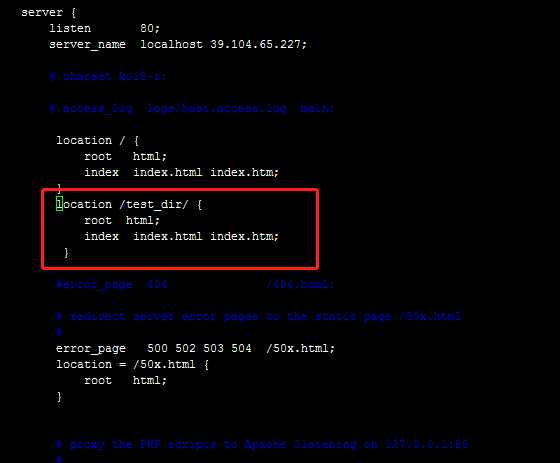
4.重启nginx服务
```
cd sbin/
./nginx -t
./nginx -s reload
```
5.线上访问
```
浏览器中输入网址：
http://39.104.65.227/test_dir/main.pptx(浏览器无法直接浏览ppt，可以浏览html文件)
```
***


